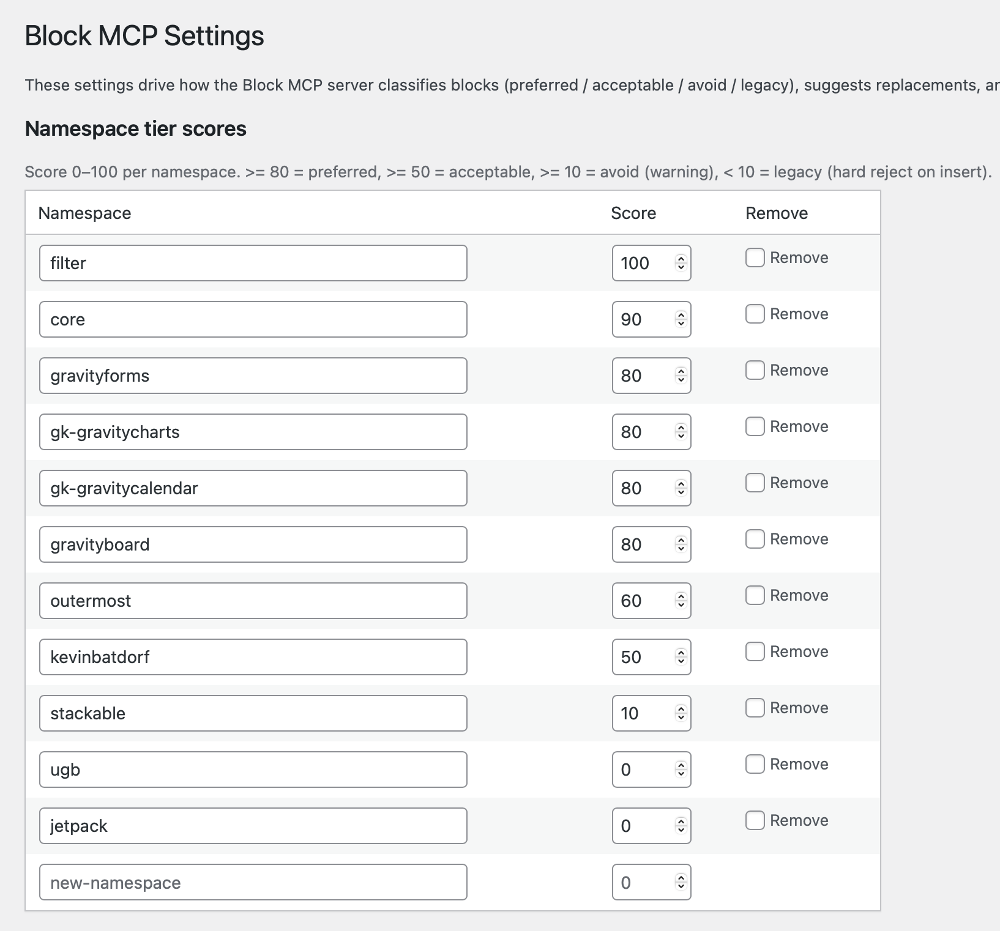
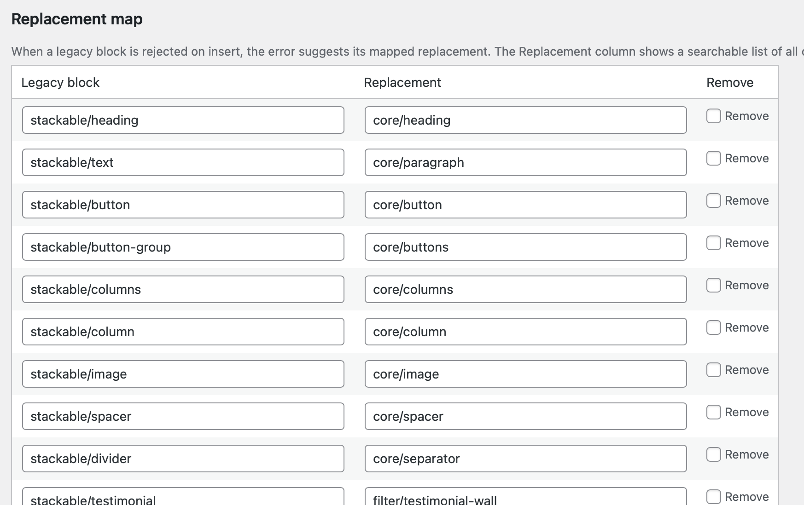
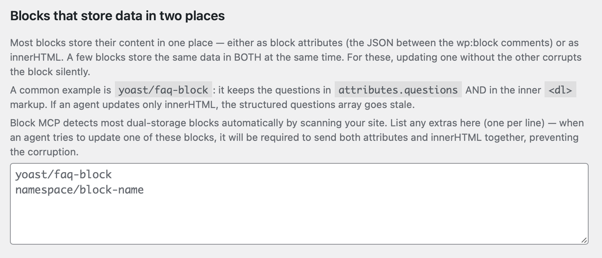
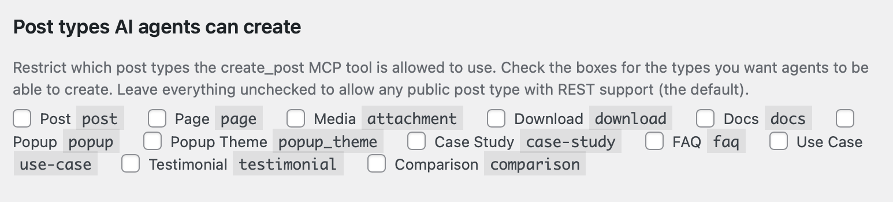
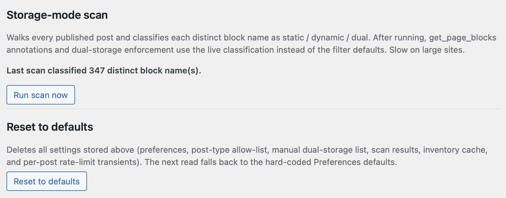

# Block MCP

> Surgical block-level content editing for WordPress via the Model Context Protocol.

An MCP server + WordPress plugin that lets AI agents read, edit, and restructure Gutenberg block content as nested JSON instead of raw HTML. Every edit creates a WordPress revision for rollback. Stable block refs let agents chain mutations without re-fetching the page.

## Why this MCP

Most WordPress MCPs wrap the default REST API. That gives an agent post-level CRUD, but it stops there — to change one heading on a page, the agent has to read the entire `post_content` HTML, parse it, find the right tag, mutate it, and write the whole thing back. Block boundaries dissolve, structure breaks subtly, and there's no undo path.

Block MCP is built around the block tree itself. The agent sees a structured, addressable, well-typed view of the page — and writes through purpose-built endpoints that know what blocks are.

What that gets you in practice:

- **Block-aware editing.** Change a heading's level, swap a button's URL, reorder columns — without touching surrounding HTML. The agent works in JSON; the plugin handles parse/serialize.
- **Stable block refs.** Every block carries a persistent ID. An agent can fetch a page once, capture the refs of every block it intends to edit, then chain inserts/deletes/updates against those refs without re-reading. Sibling shifts don't invalidate the addresses.
- **Path-based structural ops.** Nine operations (`update-attrs`, `replace-block`, `wrap-in-group`, `unwrap-group`, `move`, `duplicate`, `insert-child`, `remove-block`, `update-html`) work on any nesting depth via integer paths or refs.
- **Auto-transforms.** Change a heading's `level` attribute and the `<h2>`/`<h3>` tag updates with it. Toggle a list to ordered and `<ul>` becomes `<ol>`. The plugin keeps attributes and innerHTML in sync for the common patterns so agents don't have to.
- **Site policy enforcement.** Per-site preference tiers reject inserts of blocks you've marked as legacy and surface suggested replacements. An agent can't write blocks your site doesn't want.
- **Revision-backed undo.** Every write returns `before_revision_id` and `revision_id`. `revert_to_revision` rolls back to either side of any edit.
- **Discovery tools.** Browse registered block types with preference scoring, search patterns, query site-wide block/pattern usage, resolve URLs to post IDs. The agent can plan with knowledge of what your site actually contains.
- **Static-block safety guards.** Warns when an attribute change would leave rendered markup stale, so the agent knows when to also pass innerHTML.

The combination — block-aware, ref-stable, revision-tracked, policy-enforcing — is what existing REST-API-wrapping MCPs don't give you.

## Compared to other WordPress MCPs

The WordPress MCP space is small and the projects work at different layers — they're more complementary than competing.

**[InstaWP/mcp-wp](https://github.com/InstaWP/mcp-wp)** — A REST-API-wrapping MCP that operates on whole posts, plus broad coverage of users, comments, media, plugins, and plugin-repo search. Standout feature: multi-site management from one MCP instance. Reach for it when you need post-level CRUD across many sites or general-purpose WordPress administration. It's not block-aware: editing a single heading inside a long page means reading and rewriting the entire post.

**[WordPress/mcp-adapter](https://github.com/WordPress/mcp-adapter)** — The official WordPress-org adapter that bridges WordPress's core Abilities API (`wp_register_ability()`, shipped in WP 6.9) to the MCP specification. It's a framework, not an end-user tool — by itself it exposes only built-in abilities. To make it useful for content editing, you (or some other plugin) still need to register abilities that do the actual work. Reach for it when you're building first-party WordPress AI integrations and want the blessed transport, permissions, and observability story.

**Block MCP** (this project) — Operates one layer below: inside a single post's block tree. Path- and ref-based addressing, auto-transforms, preference-tier enforcement, per-block revisions. None of those exist in the other two. Reach for it when an agent needs to edit *blocks* — change a heading level, swap a column layout, insert a CTA after the third paragraph — without rewriting the surrounding content.

These can all coexist. Block MCP could (and likely will) be exposed through the official adapter as registered abilities once that path matures — same logic, blessed plumbing. See [issues](https://github.com/GravityKit/block-mcp/issues) for the roadmap.

## Features

**Read**
- Full block tree as structured JSON: paths, names, attributes, refs, `text_preview` of each block's content
- Page summary in one call: block type counts, headings with paths, section markers, max nesting depth
- Outline mode for fast page structure inspection
- Search blocks by text or block name
- Render mode expands shortcodes, resolves synced patterns, marks dynamic blocks

**Write — by index, by ref, or by path**
- `update_block` — flat-index OR ref
- `delete_block` — top-level counter OR ref
- `insert_blocks` — anchor on `after_top_level`/`before_top_level` OR `after_ref`/`before_ref`
- `edit_block_tree` — 9 path-based or ref-based structural ops:
  - `update-attrs`, `update-html`, `replace-block`, `remove-block`
  - `wrap-in-group`, `unwrap-group`, `insert-child`, `duplicate`, `move`
- `rewrite_post_blocks` — full page rewrite
- `dry_run` parameter to validate any mutation without writing

**Safety**
- Auto-transform keeps innerHTML in sync when attributes change (heading level, list ordered, group tagName, button URL, image src, spacer height, etc.)
- Static block guards warn when an attribute change may leave rendered markup stale
- Configurable preference tiers: legacy blocks rejected on insert, avoid-tier blocks return warnings with suggested replacements
- Per-post rate limiting (10 writes/min, 2 full rewrites/min)
- Every write creates a WordPress revision; `revert_to_revision` undoes any edit

**Discover**
- List block types filtered by namespace, category, or preference tier
- Browse patterns (synced + registered) scored by recency, reference count, and legacy content
- Site-wide block/pattern usage analytics (cached)
- Resolve any URL or slug to its post ID, type, and edit link

## How It Works

```
AI Agent  ←stdio→  MCP server (your machine)  ←HTTPS→  WordPress plugin (your site)
```

**WordPress plugin** (`wordpress-plugin/gk-block-api/`) — REST API at `gk-block-api/v1`. Handles block parsing, serialization, safety checks, preference scoring, rate limiting, revisions. Works with any post type that stores Gutenberg blocks in `post_content`.

**MCP server** (`src/`) — TypeScript stdio server that exposes the REST API as MCP tools. Authenticates as a normal WordPress user via Application Password. No special privileges, no direct DB access from the MCP side.

## Quick Start

### 1. Install the WordPress plugin

Copy `wordpress-plugin/gk-block-api/` to your site's `wp-content/plugins/` and activate it. Or install via WP-CLI:

```bash
wp plugin install /path/to/block-mcp/wordpress-plugin/gk-block-api --activate
```

### 2. Create an Application Password

In WordPress admin: **Users → Profile → Application Passwords**. Or via CLI:

```bash
wp user application-password create <username> "Block MCP" --porcelain
```

The user needs at minimum the `edit_posts` capability for any post you want to read or write.

### 3. Install and configure the MCP server

```bash
git clone https://github.com/GravityKit/block-mcp
cd block-mcp
npm install   # auto-builds dist/index.cjs via the prepare script
```

Register the server in your MCP client. Example for Claude Code's `~/.claude.json`:

```json
{
  "mcpServers": {
    "block-mcp": {
      "command": "node",
      "args": ["/absolute/path/to/block-mcp/dist/index.cjs"],
      "env": {
        "GK_SITE_URL": "https://example.com",
        "GK_BLOCK_API_USER": "your-wp-username",
        "GK_BLOCK_API_APP_PASSWORD": "xxxx xxxx xxxx xxxx xxxx xxxx"
      }
    }
  }
}
```

Restart your MCP client. Run `npm run inspect` to test the tools interactively.

### 4. (Optional) Tune the settings

When the plugin is active, an admin page appears at **Settings → Block MCP**. The defaults work out of the box, but it's worth a look — this is where you decide which blocks AI agents are allowed to write, what to suggest as replacements, and which post types `create_post` can target.



See the [Configuration](#configuration) section below for the full breakdown.

## MCP Tools

**Content I/O**

| Tool | Purpose |
|---|---|
| `get_page_blocks` | Read a post's blocks. Supports `outline`, `summary_only`, `search`, `block_name`, `render`, `fields`, `persist_refs` |
| `update_block` | Update one block's attributes/innerHTML (by `flat_index` or `ref`) |
| `insert_blocks` | Insert blocks at a position (by counter or ref) |
| `delete_block` | Remove block(s) (by counter or ref) |
| `replace_block_range` | Atomic single-revision swap of N blocks for M blocks |
| `rewrite_post_blocks` | Full page rewrite |
| `edit_block_tree` | 9 path-or-ref-based structural ops |
| `insert_pattern` | Insert a pattern, synced or inline |
| `revert_to_revision` | Roll back to a prior revision ID |

**Posts & taxonomies**

| Tool | Purpose |
|---|---|
| `create_post` | Create a post or page (draft, publish, future) — accepts blocks or HTML |
| `update_post` | Update post metadata, status, terms — covers publish/trash/untrash transitions |
| `list_terms` | List taxonomy terms (categories, tags, custom) for ID lookup |
| `find_posts` / `post_info` / `resolve_url` | Locate posts by search, ID, slug, or URL |

**Media**

| Tool | Purpose |
|---|---|
| `upload_media` | Upload via local path, URL sideload (with SSRF guard), or base64. Returns attachment ID + URL |

**Discovery**

| Tool | Purpose |
|---|---|
| `list_block_types` | Browse registered block types with preference tiers |
| `list_patterns` / `get_pattern` | Search and inspect patterns with scoring |
| `get_site_usage` | Block/pattern usage analytics |

**SEO** (when [Yoast SEO](https://wordpress.org/plugins/wordpress-seo/) is active)

| Tool | Purpose |
|---|---|
| `yoast_get_seo` | Read SEO metadata: title, description, robots, OG, Twitter, schema, scores |
| `yoast_update_seo` / `yoast_bulk_update_seo` | Update SEO fields on one or many posts |

## Stable Refs

Every block in a `get_page_blocks` response includes a `ref` field:

```json
{
  "index": 5,
  "path": [0, 2, 1],
  "ref": "blk_a3f2c1q9",
  "name": "core/heading",
  "attributes": { "level": 2, "content": "Hello" }
}
```

Refs are stored in `attrs.metadata.gk_ref` inside `post_content`, so they survive across sessions and across mutations that shift sibling positions. Pass `ref` to `update_block`, `delete_block`, or `edit_block_tree` to address the same block reliably even after inserts or deletes elsewhere on the page.

The first read of a post lazily assigns + persists refs via a direct DB write that skips revision creation (refs are editor-only metadata, not content). Pass `persist_refs: false` to read without that side effect.

## Configuration

Everything in this section is editable at **Settings → Block MCP** in WordPress admin. Defaults are sensible — none of this is required to get started.

### Namespace tier scores

Block preferences are stored as a WordPress option (`gk_block_api_preferences`) and configurable per-site. Each block namespace gets a score 0–100, which maps to a tier:

| Tier | Score | Policy |
|---|---|---|
| **preferred** | ≥ 80 | Use freely |
| **acceptable** | 50–79 | Use if preferred unavailable |
| **avoid** | 10–49 | Warn, return suggested replacement |
| **legacy** | < 10 | Reject on insert |

Defaults ship with `core/*` preferred and a starter set of known-deprecated namespaces marked legacy. Add new namespaces by typing into the bottom row — a fresh blank row appears as soon as you start typing.

### Replacement map

When an agent attempts to insert a legacy block, the rejection error includes a suggested replacement from this map. Both columns are searchable dropdowns of every block currently registered on your site (you can also type a block name that isn't currently registered).



### Blocks that store data in two places

A few blocks (notably `yoast/faq-block`) keep the same data in *both* their attributes and their innerHTML. Updating one without the other corrupts the block silently. Block MCP detects most automatically by scanning your site; list any extras here so the API forces agents to send both fields together.



### Post types AI agents can create

Restrict `create_post` to specific post types. Leave everything unchecked to allow any public post type with REST support (the default).



### Storage-mode scan + reset

The scan walks every published post and classifies each distinct block as static / dynamic / dual, replacing the filter defaults with live data from your site. Slow on large sites; the result is cached. The Reset button below it clears every option this plugin owns and restores hard-coded defaults.



## Examples

**Update a heading by URL**

> "Change the H2 'Welcome' on `/about/` to 'About Us'."

1. `resolve_url({ url: "/about/" })` → post ID
2. `get_page_blocks({ post_id, outline: true })` → finds heading at `path: [4]`, ref `blk_a3f2c1q9`
3. `edit_block_tree({ post_id, op: "update-attrs", ref: "blk_a3f2c1q9", attributes: { content: "About Us" } })`

Auto-transform updates both the `content` attribute and the inner `<h2>` text. Revision created.

**Chained edit workflow (where refs shine)**

> "On the homepage: delete the third paragraph, change the next H2 to H3, and add a CTA button after it."

1. `get_page_blocks({ post_id })` once — capture refs for all three target blocks
2. `delete_block({ post_id, ref: <para-ref> })`
3. `edit_block_tree({ post_id, op: "update-attrs", ref: <heading-ref>, attributes: { level: 3 } })`
4. `insert_blocks({ post_id, after_ref: <heading-ref>, blocks: [{ name: "core/buttons", … }] })`

With path-based addressing, the agent would need to re-fetch between every step. With refs, one read covers the whole chain.

**Author and publish a doc**

1. `list_terms({ taxonomy: "category", search: "Documentation" })` → category ID
2. `create_post({ title: "Getting Started", status: "draft", categories: [<id>], blocks: [...] })` → post ID
3. `upload_media({ path: "/tmp/screenshot.png", alt_text: "...", post_id })` → attachment ID + URL
4. `insert_blocks({ post_id, after_top_level: 0, blocks: [{ name: "core/image", attributes: { id: <atch>, url, alt: "..." } }] })`
5. `yoast_update_seo({ post_id, title: "...", description: "...", focus_keyword: "..." })`
6. `update_post({ post_id, status: "publish" })`

## Testing

Run all suites locally:

```bash
# TypeScript (Vitest) — 230 tests
npm test

# PHP (PHPUnit, stub WP bootstrap) — 286 tests
cd wordpress-plugin/gk-block-api && phpunit -c tests/phpunit.xml
```

The PHP suite uses a minimal WordPress stub layer (no full WP install required) to exercise validation, error paths, mutation engine, ref resolution, HTML auto-transforms, post lifecycle, term listing, media validation, and REST summary/outline.

An end-to-end smoke script is included under `scripts/` for live-WordPress validation; point it at any WordPress site by setting `GK_SITE_URL`, `GK_BLOCK_API_USER`, and `GK_BLOCK_API_APP_PASSWORD`.

## Requirements

- Node.js ≥ 20
- WordPress ≥ 6.0 with Application Passwords enabled
- PHP ≥ 7.4
- HTTPS (required by WordPress for Application Password authentication)

## Limitations

- Edits work on posts stored as blocks. Block-theme templates (`wp_template`, `wp_template_part`) and widget areas are not yet supported.
- Rate limits are per-post, not per-user — multiple agents editing the same post share the budget.
- Static block innerHTML cannot be regenerated server-side (WordPress has no PHP equivalent of the React `save` function). Auto-transforms cover the common cases; for anything else, supply innerHTML explicitly.

## License

- WordPress plugin: GPL-2.0-or-later
- MCP server: MIT

## Contributing

Issues and PRs welcome at [github.com/GravityKit/block-mcp](https://github.com/GravityKit/block-mcp). Run the test suites before submitting; new mutations should ship with PHPUnit + Vitest coverage.
